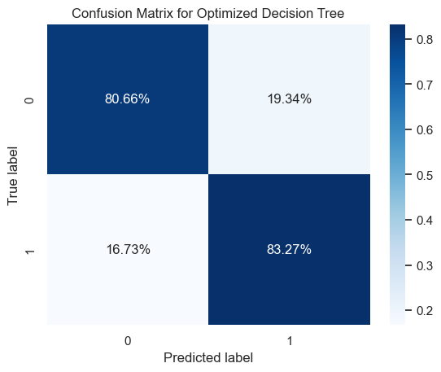
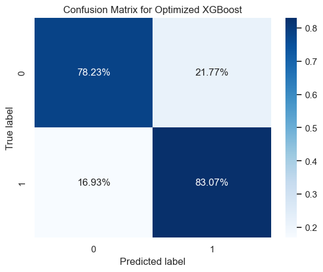

[](https://github.com/neuefische/ds-ml-project-template/actions/workflows/workflow-02.yml)

# ML Project: Fraud Detection for STEG


This repo contains the Machine Learning Project of the neuefische Data Science, Machine Learning & AI Bootcamp 2024 in Hamburg. The team members are:

- Tetyana Samolyenko
- Christian Reimann
- Jakob Koscholke

Our goal is to develop a Fraud-Detection System for the The Tunisian Company of Electricity and Gas (STEG), a public and a non-administrative company, responsible for delivering electricity and gas across Tunisia. The company suffered tremendous losses in the order of 200 million Tunisian Dinars due to fraudulent manipulations of meters by consumers. Using the client’s billing history, our aim is to detect clients involved in fraudulent activities. More precisely:

- Goal: identify clients involved in fraudulent activities,leave non-fraudulent clients aside
- Value of Product: enhance the company’s revenues by reducing the losses caused by fraudulent activities, avoid reputation damage
- Evaluation Metric: ROC-AUC, but True Positive Rate and True Negative Rate will also be inspected

## Data

The data used for this project can be found on Zindi: 

- https://zindi.africa/competitions/fraud-detection-in-electricity-and-gas-consumption-challenge/data


The following column documentation was provided by the STEG:

- Client_id: Unique id for client
- District: District where the client is
- Client_catg: Category client belongs to
- Region: Area where the client is
- Creation_date: Date client joined
- Target: fraud:1 , not fraud: 0
- Invoice_date: Date of the invoice
- Tarif_type: Type of tax
- Counter_number:
- Counter_statue: takes up to 5 values such as working fine, not working, on hold statue, ect
- Counter_code:
- Reading_remarque: notes that the STEG agent takes during his visit to the client (e.g: If the counter shows something wrong, the agent gives a bad score)
- Counter_coefficient: An additional coefficient to be added when standard consumption is exceeded
- Consommation_level_1: Consumption_level_1
- Consommation_level_2: Consumption_level_2
- Consommation_level_3: Consumption_level_3
- Consommation_level_4: Consumption_level_4
- Old_index: Old index
- New_index: New index
- Months_number: Month number
- Counter_type: Type of counter

Unfortunately, this is not a very good documentation. Some columns are left unexplained, and most explanations are not helpful.

## Tested Classifiers

<div><style>
.dataframe > thead > tr,
.dataframe > tbody > tr {
  text-align: right;
  white-space: pre-wrap;
}
</style>
<table border="1" class="dataframe"><thead><tr><th>Model</th><th>ROC-AUC</th><th>True Positive Rate</th><th>True Negative Rate</th><th>Elapsed Time in Seconds</th></tr></thead><tbody><tr><td>&quot;Decision Tree&quot;</td><td>0.813529</td><td>0.824833</td><td>0.801415</td><td>6.615412</td></tr><tr><td>&quot;Random Forest&quot;</td><td>0.867407</td><td>0.792444</td><td>0.771914</td><td>52.600034</td></tr><tr><td>&quot;Extra Trees&quot;</td><td>0.862694</td><td>0.784062</td><td>0.767552</td><td>50.269403</td></tr><tr><td>&quot;AdaBoost&quot;</td><td>0.659015</td><td>0.625867</td><td>0.605927</td><td>34.564976</td></tr><tr><td>&quot;LightGBM&quot;</td><td>0.727527</td><td>0.674011</td><td>0.649917</td><td>4.244878</td></tr><tr><td>&quot;XGBoost&quot;</td><td>0.763917</td><td>0.691182</td><td>0.687353</td><td>2.807551</td></tr><tr><td>&quot;CatBoost&quot;</td><td>0.782227</td><td>0.711931</td><td>0.695365</td><td>47.220879</td></tr><tr><td>&quot;Naive Bayes&quot;</td><td>0.598696</td><td>0.967253</td><td>0.08631</td><td>1.98632</td></tr><tr><td>&quot;Logistic Regression&quot;</td><td>0.623952</td><td>0.596349</td><td>0.58452</td><td>3.465537</td></tr></tbody></table></div>

Three model types were excluded due to long processing time or excessive effort:

1. K-Nearest Neighbors
1. Support Vector Machines
1. Artificial Neural Networks


## Cross Validation

<div><style>
.dataframe > thead > tr,
.dataframe > tbody > tr {
  text-align: right;
  white-space: pre-wrap;
}
</style>
<table border="1" class="dataframe"><thead><tr><th>Model</th><th>ROC-AUC</th><th>True Positive Rate</th><th>True Negative Rate</th></tr></thead><tbody><tr><td>&quot;Optimized Decision Tree&quot;</td><td>0.820123</td><td>0.832743</td><td>0.806595</td></tr><tr><td>&quot;Optimized XGBoost&quot;</td><td>0.891098</td><td>0.830667</td><td>0.782283</td></tr></tbody></table></div>

The results can be summarized as follows:

- Decision Tree: this model strikes a nice balance between a high ROC-AUC score while also making sure that in many cases fraudulent activity and non-fraudulent activity are detected as such.

- XGBoost: this model achieved an even higher ROC-AUC score, compromising on the True Negative Rate





## Set up your Environment

### macOS 

For installing the virtual environment you can either use the [Makefile](Makefile) and run `make setup` or install it manually with the following commands:

```bash
make setup
```
After that active your environment by following commands:

```bash
source .venv/bin/activate
```

Or install the virtual environment and the required packages by following commands:

```BASH
pyenv local 3.11.3
python -m venv .venv
source .venv/bin/activate
pip install --upgrade pip
pip install -r requirements.txt
```
    
### Windows

Install the virtual environment and the required packages by following commands.

   For `PowerShell` CLI :

```PowerShell
pyenv local 3.11.3
python -m venv .venv
.venv\Scripts\Activate.ps1
python -m pip install --upgrade pip
pip install -r requirements.txt
```

For `Git-bash` CLI :

```BASH
pyenv local 3.11.3
python -m venv .venv
source .venv/Scripts/activate
python -m pip install --upgrade pip
pip install -r requirements.txt
```
If you encounter an error when trying to run `pip install --upgrade pip`, try using the following command:

```Bash
python.exe -m pip install --upgrade pip
```


